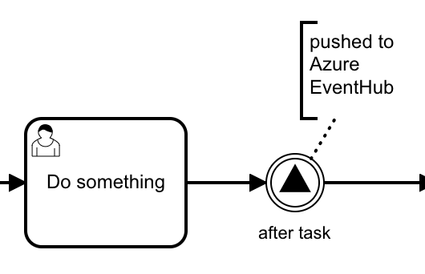

# Push Signal to Azure Event Hub Plugin

A Plugin for [Camunda BPM](http://docs.camunda.org) that sends an event to Azure Event Hub whenever a [Throwing Signal Event](https://docs.camunda.org/manual/latest/reference/bpmn20/events/signal-events/#throwing-signal-events) is visited.
It uses the [Passing Variables](https://docs.camunda.org/manual/latest/reference/bpmn20/events/signal-events/#passing-variables) definition to specify the event's payload.

## Show me the important parts

- [SignalToEventHubPlugin.java](src/main/java/com/camunda/consulting/eventhubplugin/SignalToEventHubPlugin.java) is the main plugin class, preparing the Azure Event Hub Client and registering a parse listener.
- [ParseListener.java](src/main/java/com/camunda/consulting/eventhubplugin/ParseListener.java) attaches an [end execution listener](https://docs.camunda.org/manual/latest/user-guide/process-engine/delegation-code/#execution-listener) to every throwing signal event.
- [SignalToEventHubListener.java](src/main/java/com/camunda/consulting/eventhubplugin/SignalToEventHubListener.java) collects data of the issued signal, calculates the variable in-mapping elements and creates a JSON message to be sent to EventHub. 
- [AzureEventHubClient.java](src/main/java/com/camunda/consulting/eventhubplugin/AzureEventHubClient.java) contains a simple Azure EventHub client implementation.

## How to use it

For using it in a Camunda installation, you have to [integrate the plugin into your Camunda BPM configuration](https://docs.camunda.org/manual/latest/user-guide/process-engine/process-engine-plugins/).
You can set the following plugin properties:

- namespaceName
- eventHubName
- sasKeyName
- sasKey
- endpoint

They are handed into Azure's [ConnectionStringBuilder](https://docs.microsoft.com/en-us/java/api/com.microsoft.azure.eventhubs.connectionstringbuilder) to create the connection to EventHub.
 
## Environment Restrictions

Built and tested against Camunda BPM version 7.12.0.

## Known Limitations

## Improvements Backlog

## License

[Apache License, Version 2.0](http://www.apache.org/licenses/LICENSE-2.0).

<!-- HTML snippet for index page
  <tr>
    <td></td>
    <td><a href="snippets/engine-plugin-on-demand-call-activity">On-demand Call Activity Plugin</a></td>
    <td>A Plugin for [Camunda BPM](http://docs.camunda.org) that sends an event to Azure Event Hub whenever a [Throwing Signal Event](https://docs.camunda.org/manual/latest/reference/bpmn20/events/signal-events/#throwing-signal-events) is visited.</td>
  </tr>
-->
<!-- Tweet
New @CamundaBPM example: Push Signal to Azure Event Hub Plugin - A Plugin for Camunda BPM] that sends an event to Azure Event Hub whenever a Throwing Signal Event is visited. that allows to skip the invocation of a sub-process. https://github.com/camunda-consulting/code/tree/master/snippets/engine-plugin-signal-to-azure-eventhub
-->
