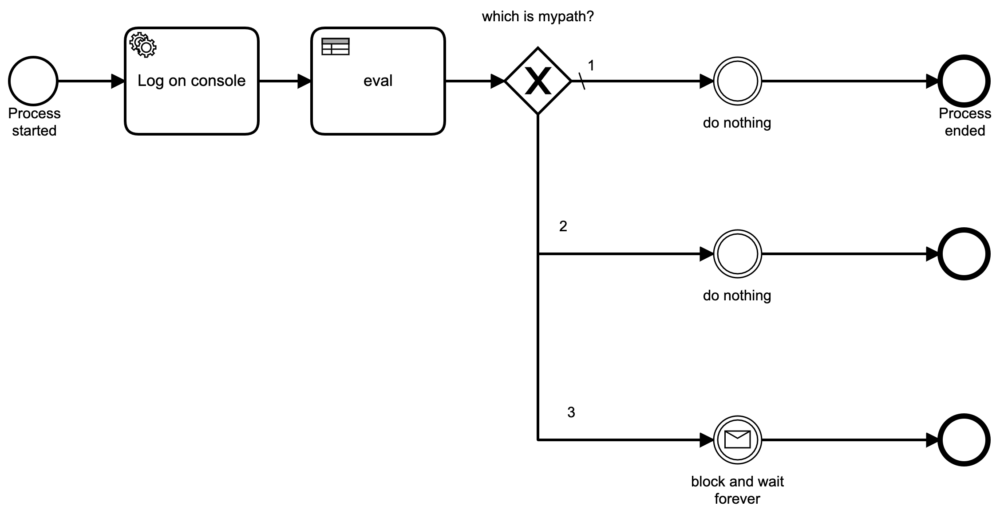
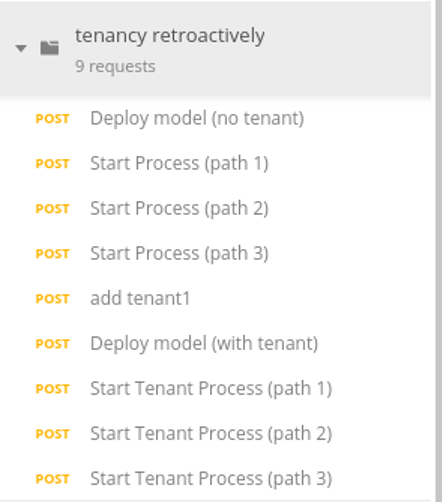
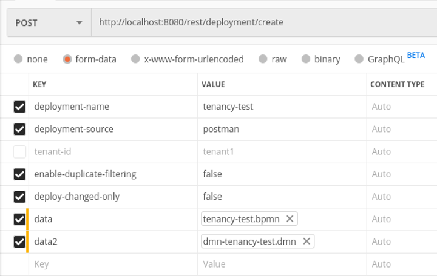
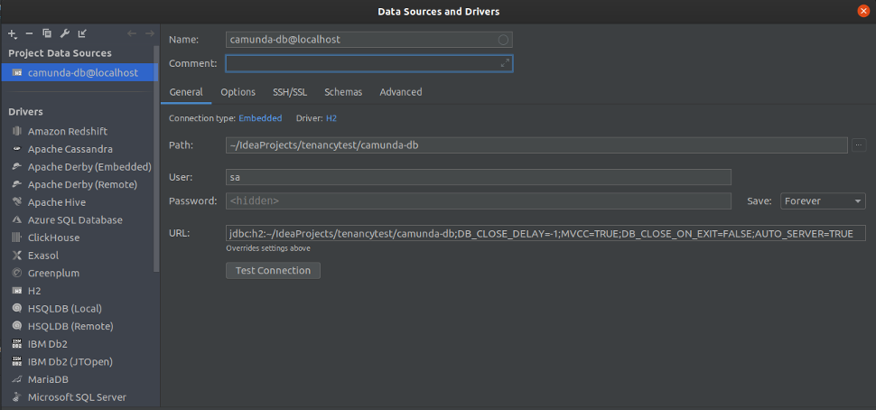

# Retroactively Apply Tenancy to Existing BPMN Process and DMN Decision Table 
A sample application with [Camunda BPM](http://docs.camunda.org) that retroactively applies tenancy to an existing process and decision table.

## Show me the important parts!

Snippet from [addTenant.sql](addTenant.sql#L36-L46) : 

```
update ACT_HI_PROCINST
set TENANT_ID_='tenant1'
where PROC_DEF_ID_ in (
    select ID_ from ACT_RE_PROCDEF where KEY_ = 'tenancy-test'
    );

update ACT_HI_TASKINST
set TENANT_ID_='tenant1'
where PROC_DEF_ID_ in (
    select ID_ from ACT_RE_PROCDEF where KEY_ = 'tenancy-test'
    );

update ACT_HI_VARINST
set TENANT_ID_='tenant1'
where PROC_DEF_ID_ in (
    select ID_ from ACT_RE_PROCDEF where KEY_ = 'tenancy-test'
    );
```

## Example BPMN Process used in example:



## Example DMN Decision Table used in example:


The included addTenant.sql will update all relevant history tables with the new tenant identifier into the TENANT_ID_ column which effectively
migrates all previously completed process instances. It will also update all relevant runtime tables with the new tenant identifier into the TENANT_ID_ 
column, which migrates any currently running process instances to the new tenant.

## Introduction

The purpose of this proof of concept is to show how one might handle the following scenario:

- Over time, data has been collected in Camunda BPM for processes and decision tables, with no multi-tenancy designations.
- User would later like to utilize multi-tenancy functionality in Camunda BPM
- User would like legacy process and decision data to retroactively be labeled as data that falls under a new tenant.

This project example walks thru deploying a process with business rules, creating data for many versions, then creating a tenant designation, and finally running a database script that will retroactively label existing data for that process in both History and Runtime as belonging to the tenant.

**NOTE** : Please follow the instructions carefully and note that any time that you directly massage data like this, you are taking a RISK. PLEASE TEST EXTENSIVELY AND THOROUGHLY against production-like data in a testing/staging environment, per your own SDLC, before moving forward with doing this in your production environment. The information included here is meant to be an example that you are to follow and comprehend before conforming a similar strategy in your own environment.

## Prerequisites

* Maven + Java. This is the minimum needed to run this Spring Boot sample application. It might be preferred to run in your own professional IDE (like IntelliJ or Eclipse).
* A database client that will allow you to connect to an embedded H2 database via JDBC. You will need this to run the database script included.
* Postman. This is needed to make REST api calls using the included Postman collection json.


## Steps

1. Run the CamundaApplication class in Spring Boot. This should start up a Camunda BPM instance with no process definitions deployed, using an H2 Database in an &quot;embedded&quot; form. That means that on start, H2 will persist data in files in the root of the project with files ending in &quot;.db&quot;. It might look something like this:

    
    
2. Open Postman. Import the &quot;tenancy retroactively.postman\_collection.json&quot; file into Postman. You should see something like this:

    

3. In Postman, select the &quot;Deploy model (no tenant)&quot; request. Make sure that the values for &quot;data&quot; and &quot;data2&quot; are cleared out and reestablished to be the files that are directly in the root of this project with the same name. The BPMN file is &quot;tenancy-test.bpmn&quot; and the DMN file is &quot;dmn-tenancy-test.dmn&quot;.

    

* Once this is done, run the request. You should be able to log in to Cockpit locally and see that the process resources have been deployed.

4. Run the following three requests in sequence, one at a time. Confirm in Cockpit that it created two completed process instances, and one runtime instance that is waiting for a message.

   

5. Repeat steps 3 and 4 two more times. This should create 3 versions of the workflow, each with 2 completed instances, and one that is in flight. This will represent our &quot;as-is&quot; data for the test. Go into Cockpit one more time. Look at the process versions and the data.
6. Run the request &quot;add tenant1&quot; in Postman. This will create the tenant reference in the Camunda database. This is equivalent to doing this in Camunda Admin.
7. Stop the Camunda Spring Boot application server.

8. Connect to the H2 Database using a database client of your choice. I did this with Jetbrains Datagrip using this JDBC URL;

    * jdbc:h2:~/IdeaProjects/tenancytest/camunda-db;DB\_CLOSE\_DELAY=-1;MVCC=TRUE;DB\_CLOSE\_ON\_EXIT=FALSE;AUTO\_SERVER=TRUE

    * User: sa

    * Pass: sa

    *Note the &quot;path&quot; value is the direct path to the \*.db file in the root of the Camunda Spring Boot BPM project. My setup looks like this (for reference):
    
    

9. After connecting, run the contents of &quot;addTenant.sql&quot; found in the root of this project. A quick inspection of this script shows that it only does updates to existing rows (no inserts), and the only thing that it is updating is the tenant designation to both runtime and history data.
10. Make sure that your database client is disconnected completely from the database.
11. Start Camunda BPM back up. Go into Cockpit and observe the results.
12. Run the remaining requests in Postman which show how to deploy and execute a process while specifying a tenant. After running, go to Cockpit and confirm that the data was simply added to the existing process.

## Summary

This is meant to be a very simple example that can be tailored to your environment as needed. Once again, please note that this is meant to be a PoC and nothing more. Please use it as a guide to your own situation.

## Environment Restrictions

Built and tested against Camunda BPM version 7.13.0-ee and JDK 8.

## Known Limitations

## License
[Apache License, Version 2.0](http://www.apache.org/licenses/LICENSE-2.0).